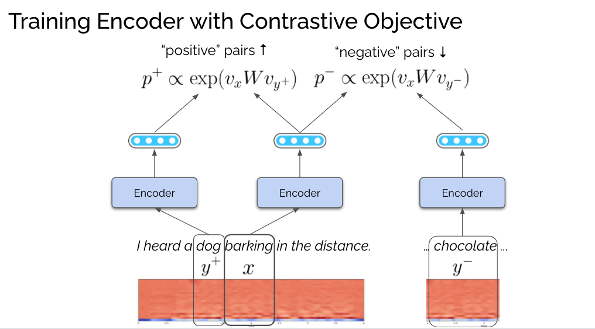

# Unsupervised Speech Translation

This repository contains source code for learning audio embeddings via a Speech2Vec CPC model.

See the following slides for more info:

* [Weekly update slides](https://docs.google.com/presentation/d/1nZjLOLjB-Lwm3I-ZRDAyotCXCAJXAJXgouyXtTyk5Kk/edit?usp=sharing)
* [SETI Institute talk slides](https://docs.google.com/presentation/d/1v-_BFgZ1n_OloOqbtun5WlOtQrMzthyHuiQob139P20/edit?usp=sharing)



## Prerequisites

First, clone this repo, and run:

```
git submodule init
git submodule update
```

You can set up an environment and install prerequisites as follows:

```
sudo apt-get install libsndfile1    # required for librosa
conda create -n myenv python=3.7
conda activate myenv
conda install pytorch torchvision torchaudio cudatoolkit=10.2 -c pytorch
pip install -r requirements.txt
```

## Datasets

The script uses the text corpus from [LibriSpeech](https://www.openslr.org/12) for generating the Morse code datasets (it does not use its audio files). You can download and extract the datasets as follows:

```
mkdir data; cd data
wget https://www.openslr.org/resources/12/dev-clean.tar.gz
tar zxvf dev-clean.tar.gz
wget https://www.openslr.org/resources/12/train-clean-100.tar.gz
tar zxvf train-clean-100.tar.gz
wget https://www.openslr.org/resources/12/train-clean-360.tar.gz
tar zxvf train-clean-360.tar.gz
```

## Generate Morse code datasets

The next step is to generate the Morse code datasets based on the LibriSpeech data. You can use the `morse.py` script to do this:

```
python unsup_st/morse.py --src data/LibriSpeech --dest data/LibriMorse --dataset dev-clean
python unsup_st/morse.py --src data/LibriSpeech --dest data/LibriMorse --dataset train-clean-100
python unsup_st/morse.py --src data/LibriSpeech --dest data/LibriMorse --dataset train-clean-360
```

## Convert datasets into features

The training script assumes that the input audio is converted to feature representations (MFCC). You can use `cache_dataset.py` to do this:

```
python unsup_st/cache_dataset.py --src data/LibriMorse --dest data/LibriMorse.cache --dataset dev-clean
python unsup_st/cache_dataset.py --src data/LibriMorse --dest data/LibriMorse.cache --dataset train-clean-100
python unsup_st/cache_dataset.py --src data/LibriMorse --dest data/LibriMorse.cache --dataset train-clean-360
```

## Train the models

Now you are ready to train the audio representation model.

To train an RNN-based CPC Speech2Vec model, run:

```
python unsup_st/speech2vec_cpc.py \
    --model rnn \
    --datadir data/LibriMorse.cache \
    --train-dataset data/LibriMorse/train-clean-100/metadata.jsonl,data/LibriMorse/train-clean-360/metadata.jsonl \
    --valid-dataset data/LibriMorse/dev-clean/metadata.jsonl \
    --outdir data/embed \
    --hidden-size 128 \
    --lr 1e-3 \
    --batch-size 450 \
    --additive-margin 0.2
```

To train a Transformer-based CPC Speech2Vec model, run:

```
python unsup_st/speech2vec_cpc.py \
    --model transformer \
    --datadir data/LibriMorse.cache \
    --train-dataset data/LibriMorse/train-clean-100/metadata.jsonl,data/LibriMorse/train-clean-360/metadata.jsonl \
    --valid-dataset data/LibriMorse/dev-clean/metadata.jsonl \
    --outdir data/embed \
    --hidden-size 128 \
    --layers 2 \
    --lr 1e-3 \
    --batch-size 450 \
    --additive-margin 0.2
```

Here are the command line options:

* `--model`: either `rnn` (RNN-based) or `transformer` (Transformer-based)
* `--datadir`: directory containing audio features (output of `cache_dataset.py` above)
* `--train-dataset`: comma delimited list of `metadata.jsonl` files generated by `morse.py`
* `--valid-dataset`: this is read but not used for training
* `--outdir`: directory for writing the learned embedding files
* `--hidden-size`: size of the hidden states (= size of the final embedding vectors)
* `--layers`: number of Transformer layers (this does not work for the RNN-based model, which always has one layer)
* `--lr`: learning rate
* `--batch-size`: batch size
* `--additive-margin`: additive margin for contrastive learning. See [Yang et al. 2019](https://arxiv.org/abs/1902.08564) for more info

This training script will produce `epochxxx.vec` (where `xxx` is the epoch) under the directory specified by `--outdir`.

## Visualize embeddings

Finally, you can use `plot_embeddings.py` to visualize learned embeddings:

```
python unsup_st/plot_embeddings.py \
    --input-file data/embed/epochxxx.vec \
    --train-dataset data/LibriMorse/train-clean-100/metadata.jsonl,data/LibriMorse/train-clean-360/metadata.jsonl \
    --output-file embed.html
```

You can open `embed.html` with your browser and interact with the visualization!
